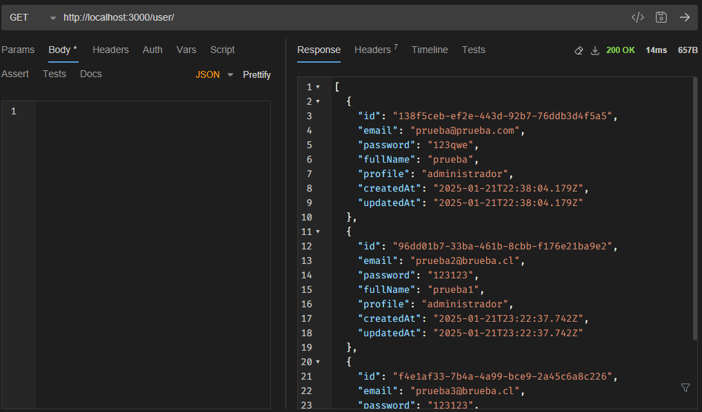
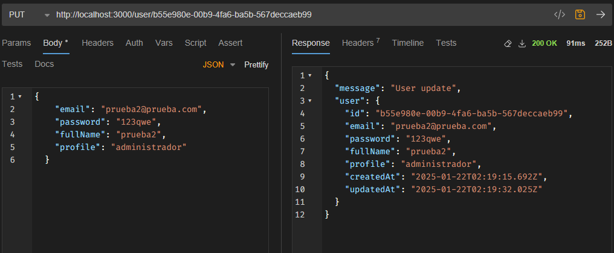
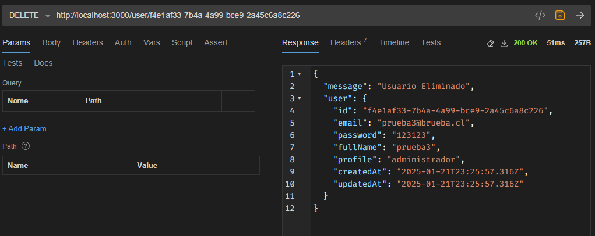
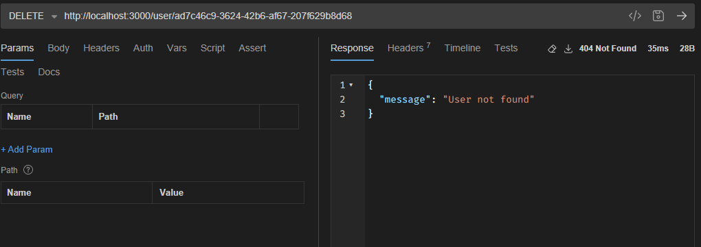

# Desafio_Prueba2_Backend_Node_Express
## Daniel_Rojas

### Instalacion de PNPM
Para iniciar el proyecto se debe instalar pnpm

En powershell 
```bash
 $env:PNPM_VERSION = "10.0.0"; Invoke-WebRequest https://get.pnpm.io/install.ps1 -UseBasicParsing | Invoke-Expression
```
o con npm 
```bash
npm install -g pnpm@latest-10
```
### Inicialización
Para iniciar el container de postgres para ejecutar se debe realizar con la siguiente linea

```bash
docker-compose up -d
```

### Paquetes instalados
Para producción
```bash
pnpm i express jsonwebtoken
pnpm install sequelize reflect-metadata sequelize-typescript
pnpm install --save pg pg-hstore

```
Para desarrollo
```bash
pnpm install --save-dev @types/node @types/validator
pnpm i -D dotenv tsx typescript
pnpm i -D @types/bcryptjs @types/express @types/jsonwebtoken @types/node
```
### Evidencia 

Metodo Get
```bash
http://localhost:3000/user/
```


Metodo Post
```bash
http://localhost:3000/user/
body
{
    "email": "prueba3@brueba.cl",
    "password": "123123",
    "fullName": "prueba3",
    "profile": "administrador",
}
```


Metodo Put
```bash
http://localhost:3000/user/:id
body
{
    "email": "prueba3@brueba.cl",
    "password": "123123",
    "fullName": "prueba3",
    "profile": "administrador"
}
```


Metodo Delete
```bash
http://localhost:3000/user/:id
```




Adicionalmente se agrega archivo de Bruno 
**bruno.json**  en la ruta **DesafioPruebarequest/bruno.json**
con los end point listo para probar